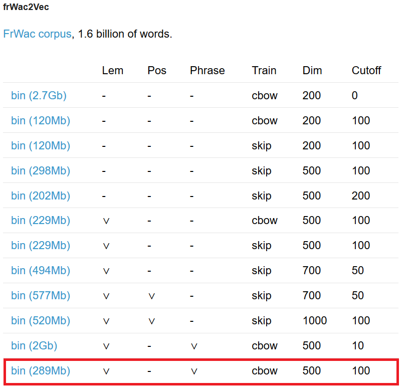

# ChatBot-with-Seq2Seq-Neural-Network
### In this work, I managed to implement a Chatbot with a sequence to sequence network and attention.
# Some notes:
### • You'll need to download a file that contains a pre-trained Embedding layer from this link: http://fauconnier.github.io/#about. It's the highlited file in the image below. Keep the file in the root directory.
<table border="0">
  <tr>
    <td>
      
    </td>
  </tr>
</table>
